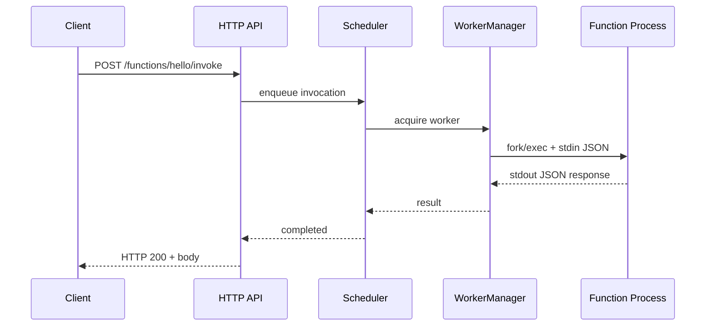

# Demo Walkthrough

End-to-end tour of the platform: register functions, invoke them, inspect workers, and read metrics.

## 1. Start the platform

**Docker:**

```bash
./scripts/docker-up.sh
```

**Local:**

```bash
./build/serverless config/config.yaml
```

## 2. Check health

```bash
curl -s http://127.0.0.1:8080/healthz | jq .
curl -s http://127.0.0.1:8080/readyz | jq .
```

## 3. Register C++ hello

```bash
curl -s -X POST http://127.0.0.1:8080/api/v1/functions \
  -H 'Content-Type: application/json' \
  -d "{
    \"name\": \"hello\",
    \"version\": \"1\",
    \"command\": \"$(pwd)/build/functions/hello-function\",
    \"min_workers\": 1,
    \"max_workers\": 4
  }" | jq .
```

Response includes `id`, `name`, `version`, and worker pool settings.

## 4. Invoke C++ hello

```bash
curl -s -X POST http://127.0.0.1:8080/api/v1/functions/hello/invoke \
  -H 'Content-Type: application/json' \
  -d '{"name":"Rohan"}' | jq .
```

Expected:

```json
{
  "body": { "message": "Hello Rohan" },
  "request_id": "req-...",
  "status": 200,
  "duration_ms": 10.2
}
```

## 5. Register Python hello

```bash
curl -s -X POST http://127.0.0.1:8080/api/v1/functions \
  -H 'Content-Type: application/json' \
  -d "{
    \"name\": \"hello-python\",
    \"version\": \"1\",
    \"command\": \"$(pwd)/functions/hello_python/run.sh\",
    \"min_workers\": 1
  }" | jq .
```

Invoke:

```bash
curl -s -X POST http://127.0.0.1:8080/api/v1/functions/hello-python/invoke \
  -H 'Content-Type: application/json' \
  -d '{"name":"Rohan"}' | jq .
```

## 6. Register Node.js hello

```bash
curl -s -X POST http://127.0.0.1:8080/api/v1/functions \
  -H 'Content-Type: application/json' \
  -d "{
    \"name\": \"hello-node\",
    \"version\": \"1\",
    \"command\": \"$(pwd)/functions/hello_node/run.sh\"
  }" | jq .
```

Invoke:

```bash
curl -s -X POST http://127.0.0.1:8080/api/v1/functions/hello-node/invoke \
  -H 'Content-Type: application/json' \
  -d '{"name":"Rohan"}' | jq .
```

## 7. List workers

```bash
curl -s http://127.0.0.1:8080/api/v1/workers | jq .
```

Shows worker processes with state (`idle`, `busy`), function assignment, and PID.

## 8. Get function metadata

```bash
curl -s http://127.0.0.1:8080/api/v1/functions/hello | jq .
```

## 9. Metrics

```bash
curl -s http://127.0.0.1:8080/metrics
```

Prometheus text format with invocation counts, latency histograms, and worker gauges.

## 10. Client demos

From repo root:

```bash
python3 demos/clients/python/invoke_demo.py http://127.0.0.1:8080 hello '{"name":"Demo"}'
node demos/clients/nodejs/invoke_demo.mjs http://127.0.0.1:8080 hello '{"name":"Demo"}'
```

## 11. Automated E2E

Run the full suite:

```bash
./scripts/e2e-test.sh http://127.0.0.1:8080
```

## What happens under the hood



See [Architecture](architecture.md) for component details.
